**Clock Domain Crossing (CDC) Design**   

Metastability refers to signals that do not assume stable 0 or 1 states for some duration of time at some point during normal operation of a design.   

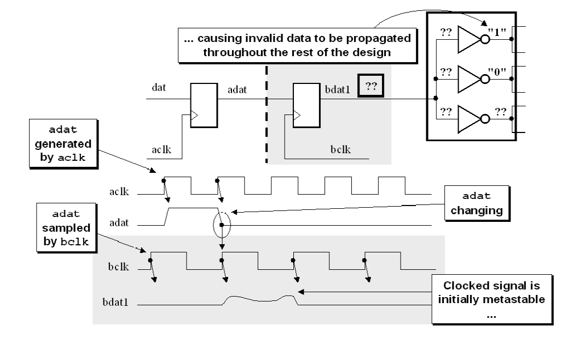


# 跨时钟域同步


## 单bit同步

### 1. 电平同步(慢到快)

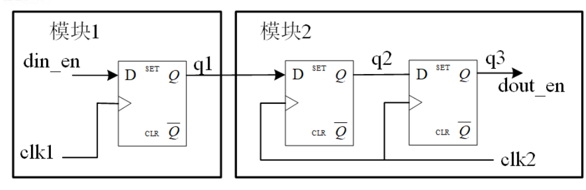


- 慢时钟向快时钟

- 使用两级触发器串联构成同步器
- 可以大大降低亚稳态出现的概率


- 如果q1信号到达时不满足D触发器建立／保持时间的情况，导致触发器的输出q2进入亚稳态状态，但q3信号会保持稳定状态。
- 通常q2的亚稳态状态持续时间不会超过一个时钟周期，两级D触发器可以消除亚稳态。
- 为了进一步提高可靠性，可以保守一些，在q3后再增加一级D触发器。
- clk2的频率是clk1频率的两倍及以上，或者使q1信号的持续周期大于两个clk2时钟周期。


- q1脉冲时序违例，导致q2陷入亚稳态且最终稳定值为0时，则q3会漏采样。
- 若需要可靠通信，需要符合三边沿准则，最好频率差2倍。
- 若频率差小于2倍，则加宽慢时钟信号宽度，如输出两个时钟周期，或使用握手方式通信


``` verilog
module level_sync (
	input clk_slow,    // slow Clock
	input clk_fast,    // fast Clock
	input rst_n   ,    // Asynchronous reset active low
	input din_en  ,

	output dout_en
);	
	reg din_en_reg ;
    reg [1 : 0] dout_en_reg ;

	always @(posedge clk_slow or negedge rst_n) begin
		if (rst_n == 1'b0) begin
			din_en_reg <= 1'b0 ;
		end
		else begin
			din_en_reg <= din_en ;
		end
	end

	always @(posedge clk_fast or negedge rst_n) begin
		if (rst_n == 1'b0) begin
            dout_en_reg[1:0] <= 2'b00 ;
		end
		else begin
            dout_en_reg[1:0] <= {dout_en_reg[0], din_en_reg} ;
		end
	end
    
    assign dout_en = dout_en_reg[1] ;
endmodule
```


### 2. 边沿检测(慢到快)

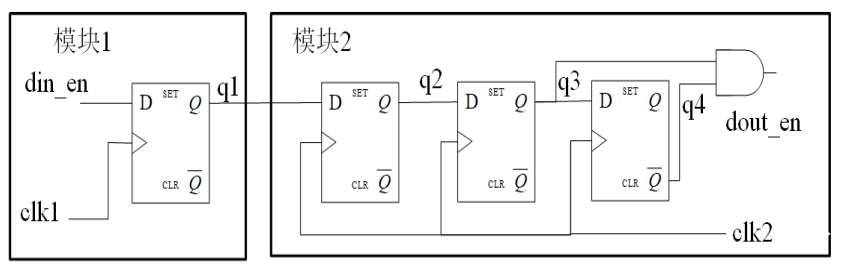


- 边沿检测同步器是在电平同步器的输出端增加一个触发器，新的触发器的输出经过反相后和电平同步器的输出进行与操作


``` verilog
module edge_detect_sync (
	input clk_slow,    // slow Clock
	input clk_fast,    // fast Clock
	input rst_n   ,    // Asynchronous reset active low
	input din_en  ,

	output dout_en
);
	reg din_en_reg ;
	reg [2 : 0] dout_en_reg ;

	always @(posedge clk_slow or negedge rst_n) begin
		if (rst_n == 1'b0) begin
			din_en_reg <= 1'b0 ;
		end
		else begin
			din_en_reg <= din_en ;
		end
	end

	always @(posedge clk_fast or negedge rst_n) begin
		if (rst_n == 1'b0) begin
			dout_en_reg[2:0] <= 3'b000 ;
		end
		else begin
			dout_en_reg[2:0] <= {dout_en_reg[1:0], din_en_reg} ;
		end
	end

	assign dout_en = dout_en_reg[1] && !dout_en_reg[2] ; //rising edge
    // assign dout_en = !dout_en_reg[1] && dout_en_reg[2] ; //falling edge


endmodule
```


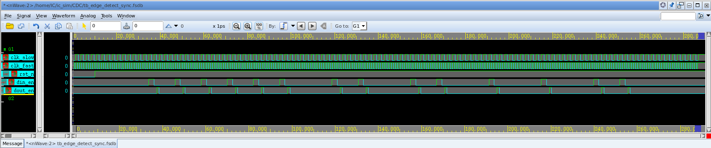


### 3. 脉冲同步(快到慢)

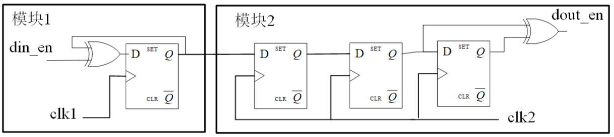


- 快时钟域单脉冲信号跨时钟到慢时钟域常使用脉冲同步器电路
- 快时钟域脉冲持续时间无法满足三边沿准则，需要通过翻转电路拉长脉冲电平以保证有效事件被采样


- 脉冲同步与clk1、 clk2的频率无关
- 两个din_en脉冲信号不能距离太近，距离不要小于 clk2 四个周期

```verilog
module pulse_sync (
	input clk_fast,    // fast Clock
	input clk_slow,    // slow Clock
	input rst_n   ,    // Asynchronous reset active low
	input din_en  ,

	output dout_en
);
	reg din_en_reg ;

	always @(posedge clk_fast or negedge rst_n) begin
		if (rst_n == 1'b0) begin
			din_en_reg <= 1'b0 ;
		end
		else begin
			din_en_reg <= din_en ^ din_en_reg ;
		end
	end

	reg [2:0] dout_en_reg ;

	always @(posedge clk_slow or negedge rst_n) begin
		if (rst_n == 1'b0) begin
			dout_en_reg <= 3'b00 ;
		end
		else begin
			dout_en_reg <= {dout_en_reg[1:0], din_en_reg} ;
		end
	end

	assign dout_en = dout_en_reg[2] ^ dout_en_reg[1] ;

endmodule
```

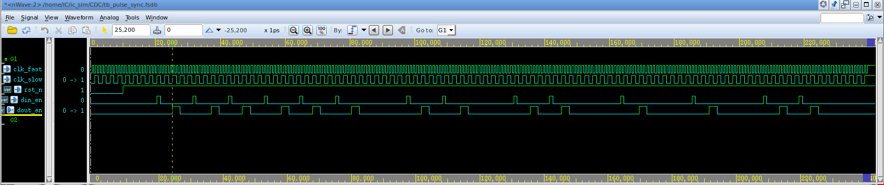


### 4. 握手同步

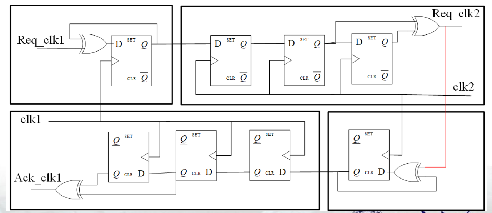


- 由两个脉冲同步器构成
- 实现较为复杂，特别是其效率不高，在对设计性能要求较高的场合应该慎用。


``` verilog
module cdc
(
    input               clk1    ,
    input               rst1_n  ,

    input               clk2    ,
    input               rst2_n  ,
    
    input               vld1    ,
    input       [7:0]   dat1    ,
    
    output  reg         vld2_r  ,
    output  reg [7:0]   dat2    ,
    output              busy                 
);

//--------------------------------------------
reg                vld1_latch;
reg                vld2_latch;
reg                vld2_latch_r;
reg                vld2_latch_2r;
wire               vld2;
reg                vld2_feedback_latch;
reg                c_latch;
reg                c_latch_r;


//--------------------------------------------
always @(posedge clk1 or negedge rst1_n)
begin
	if (!rst1_n)
		vld1_latch <= 1'b0;
	else if (vld1)       
		vld1_latch <= 1'b1;
	else if (c_latch_r) 
		vld1_latch <= 1'b0;
end

always @(posedge clk2 or negedge rst2_n)
begin
	if (!rst2_n)
	begin
		vld2_latch     <= 1'b0;
		vld2_latch_r   <= 1'b0;
		vld2_latch_2r  <= 1'b0;
	end
	else
	begin
		vld2_latch     <= vld1_latch;
		vld2_latch_r   <= vld2_latch;   
		vld2_latch_2r  <= vld2_latch_r;  
	end
end

assign vld2 = vld2_latch_r & (~vld2_latch_2r); 

always @(posedge clk2 or negedge rst2_n)
begin
	if (!rst2_n)
		vld2_feedback_latch <= 1'b0;
	else if (vld2)
		vld2_feedback_latch <= 1'b1;  
	else if (~vld2_latch_r)  
		vld2_feedback_latch <= 1'b0;
end

always @(posedge clk1 or negedge rst1_n)
begin
	if (!rst1_n)
	begin
		c_latch   <= 1'b0;
		c_latch_r <= 1'b0;
	end
	else
	begin
		c_latch   <= vld2_feedback_latch;
		c_latch_r <= c_latch;      
	end
end

assign busy = vld1_latch | c_latch_r; 

always @(posedge clk2 or negedge rst2_n)
begin
	if (!rst2_n)
		dat2 <= 8'd0;
	else if (vld2)
		dat2 <= dat1;
end

always @(posedge clk2 or negedge rst2_n)
begin
	if (!rst2_n)
		vld2_r <= 1'b0;
	else 
		vld2_r <= vld2;
end


endmodule
```


### 5. 展宽

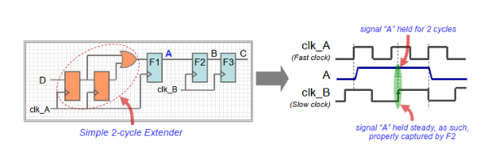

## 总线信号同步

### 1. 1位同步信号(低速通信)

- data[n-1:0]
- data_ready

同步`data_ready`信号


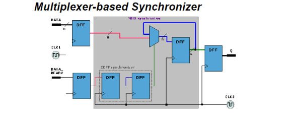


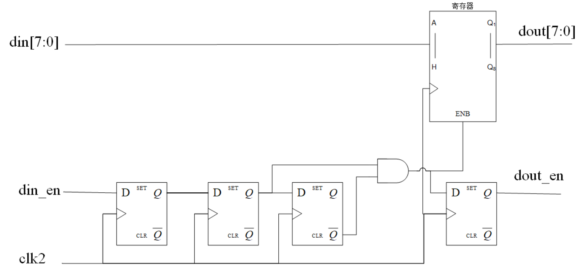

- 使用边沿同步器产生锁存使能信号，控制锁存多位数据
- 采样时刻在低速时钟周期的中央左右，数据采样是非常安全的。
- 适用于低速域向高速域通信


``` verilog
module ready_sync #(
    parameter DATA_WIDTH = 8
) (
    // input  wire clk1,
    // input  wire rstn1,
    input  wire clk2,
    input  wire rstn2,
    input  wire ready,
    input  wire [DATA_WIDTH-1:0] data,
    output reg [DATA_WIDTH-1:0] data_out
);  

    // Synchronize ready signal
    reg [2:0]ready_sync;
    always @(posedge clk2 or negedge rstn2) begin
        if (~rstn2) begin
            ready_sync <= 3'b000;
        end else begin
            ready_sync <= {ready_sync[1:0], ready};
        end
    end

    // dout enable
    wire dout_en;
    assign dout_en = ~ready_sync[2] & ready_sync[1]; // rising edge

    // Synchronize data
    reg [DATA_WIDTH-1:0] data_sync;
    always @(posedge clk2 or negedge rstn2) begin
        if (~rstn2) begin
            data_sync <= {DATA_WIDTH{1'b0}};
        end else begin
            if (dout_en) begin
                data_sync <= data;
            end else
                data_sync <= data_sync;
        end
    end

    // data_out
    always @(posedge clk2 or negedge rstn2) begin
        if (~rstn2) begin
            data_out <= {DATA_WIDTH{1'b0}};
        end else begin
            data_out <= data_sync;
        end
    end  
    
endmodule
```


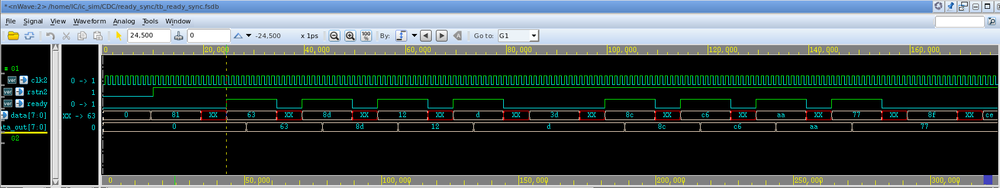


### 2. 握手同步


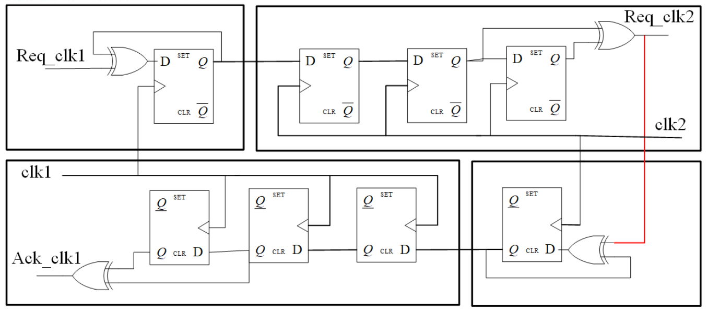


- 使用边沿同步器产生锁存使能信号，控制锁存多位数据
- 采样时刻在低速时钟周期的中央左右，数据采样是非常安全的。


``` verilog
//receive module clk_slow is 25MHz
//Asynchronous data send clk_fast of 100 MHz

module handshake_sync #(
	parameter PULSE_INIT = 1'b0	
	)(
	input rstf_n     ,  
	input rsts_n     ,
	input clk_fast   ,
	input din_en     ,
	input [7:0] din  ,  
	output reg ack_r ,
	input clk_slow   ,
	output reg dout_en   ,
	output wire [7:0] dout 
);
	reg			req_r ;
	reg	[7 : 0]	din_r ;
	reg	[7 : 0]	dout_r;

	/*-----------------------------------------------\
	 --        		 	fast clk         		 --
	\-----------------------------------------------*/
	// when pulse signal is detected in clk_fast domain
	// it is not urgent to low level    
	always @(posedge clk_fast or negedge rstf_n) begin
		if (rstf_n == 1'b0) begin
			req_r <= PULSE_INIT ;
		end
		else if (din_en) begin
			req_r <= ~req_r ;
		end
	end

	always @(posedge clk_fast) begin 
		if (din_en) begin
			din_r <= din ;
		end
	end

	/*-----------------------------------------------\
	 --        		 	 slow clk 			         --
	\-----------------------------------------------*/
	 
	 reg [2 : 0] req_syn_r ;
	 // pulse signal in sampled with clk_slow domain
	 always @(posedge clk_slow or negedge rsts_n) begin
	 	if (rsts_n == 1'b0) begin
	 		req_syn_r <= 3'b000 ;
	 	end
	 	else begin
	 		req_syn_r <= {req_r, req_syn_r[2:1]} ;
	 	end
	 end

	 wire dout_en_p ;
	 assign dout_en_p = ^req_syn_r[1:0] ;

	 always @(posedge clk_slow or negedge rsts_n) begin
	 	if (rsts_n == 1'b0) begin
	 		dout_en <= 1'b0 ;
	 	end
	 	else begin
	 		dout_en <= dout_en_p ;
	 	end
	 end

	 always @(posedge clk_slow)begin
	 	if (dout_en_p) begin
	 		dout_r <= din_r ;
	 	end
	 end

	 assign dout = dout_r ;

/*-----------------------------------------------\
 --       feedback for slow clk to fast clk     --
\-----------------------------------------------*/
    reg ack_r_p ;
    always @(posedge clk_slow or negedge rstf_n) begin
    	if (rstf_n == 1'b0) begin
    		ack_r_p <= 1'b0 ;
    	end
    	else if (dout_en_p) begin
    		ack_r_p <= ~ack_r_p ;
    	end
    end

    reg [2:0] ack_syn_r ;
    // Delayed best sampling of feedback signals

    always @(posedge clk_fast or negedge rstf_n) begin
    	if (rstf_n == 1'b0) begin
    		ack_syn_r <= 3'b000 ;
    	end
    	else begin
    		ack_syn_r <= {ack_r_p, ack_syn_r[2:1]} ;
    	end
    end

	always @(*) begin 
			ack_r = ^ack_syn_r[1:0] ;
		end	

endmodule
```


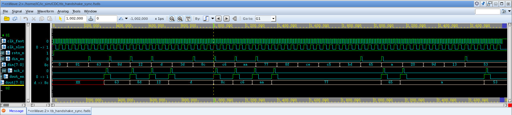


### 3. 异步FIFO(高速通信)

- FIFO（First In First Out）是异步时钟域数据传输时经常使用的一种存储器。该存储器的特点是数据先进先出（后进后出）

- 多位宽数据的异步传输问题，无论是从快时钟到慢时钟域，还是从慢时钟到快时钟域，都可以使用 FIFO 处理


- 双端口RAM
- 写指针计数器
- 写指针格雷码产生器
- 读指针同步器
- 读指针产生器
- 读指针格雷码产生器
- 写指针同步器


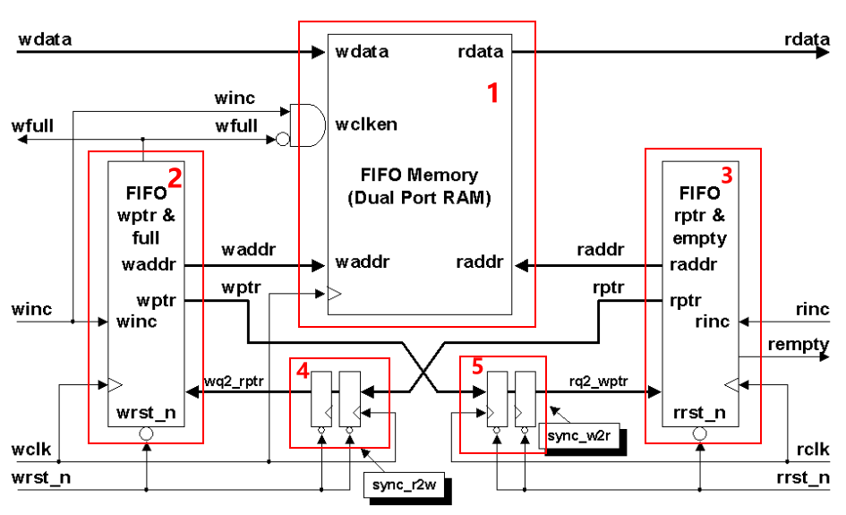


``` verilog
module asyn_fifo #(
	parameter WIDTH = 8,
	parameter DEPTH = 16			
	)(
	input					wclk,    
	input					rclk,
	input					wrstn,  
	input					rrstn,
	input					winc,
	input					rinc, 
	input	[WIDTH-1:0]		wdata,

	output wire				wfull,
	output wire				rempty,
	output wire	[WIDTH-1:0]	rdata 	    	
);
	parameter ADDR_WIDTH = $clog2(DEPTH);

	// generate addr bin
	reg [ADDR_WIDTH : 0] waddr_bin ;
	reg [ADDR_WIDTH : 0] raddr_bin ;

	always @(posedge wclk or negedge wrstn) begin
		if (wrstn == 1'b0) begin
			waddr_bin <= 'd0 ;
		end
		else if (!wfull && winc) begin
			waddr_bin <= waddr_bin + 1'd1 ;
		end
	end
	
	always @(posedge rclk or negedge rrstn) begin
		if (rrstn == 1'b0) begin
			raddr_bin <= 'd0 ;
		end
		else if (!rempty && rinc) begin
			raddr_bin <= raddr_bin + 1'd1 ;
		end
	end

	// generate addr gray
	wire [ADDR_WIDTH : 0] waddr_gray ;
	wire [ADDR_WIDTH : 0] raddr_gray ;

	reg [ADDR_WIDTH : 0] wptr ;
	reg [ADDR_WIDTH : 0] rptr ;

	assign waddr_gray = waddr_bin ^ (waddr_bin >> 1) ;
	assign raddr_gray = raddr_bin ^ (raddr_bin >> 1) ;

	always @(posedge wclk or negedge wrstn) begin
		if (wrstn == 1'b0) begin
			wptr <= 'd0 ;
		end
		else begin
			wptr <= waddr_gray ;
		end
	end

	always @(posedge rclk or negedge rrstn) begin
		if (rrstn == 1'b0) begin
			rptr <= 'd0 ;
		end
		else begin
			rptr <= raddr_gray ;
		end
	end

	// sync addr gray
	reg [ADDR_WIDTH : 0] wptr_dly1 ;
	reg [ADDR_WIDTH : 0] wptr_dly2 ;
	reg [ADDR_WIDTH : 0] rptr_dly1 ;
	reg [ADDR_WIDTH : 0] rptr_dly2 ;

	always @(posedge wclk or negedge wrstn) begin
		if (wrstn == 1'b0) begin
			rptr_dly1 <= 'd0 ;
			rptr_dly2 <= 'd0 ;
		end
		else begin
			rptr_dly1 <= rptr      ;
			rptr_dly2 <= rptr_dly1 ;
		end
	end

	always @(posedge rclk or negedge rrstn) begin
		if (rrstn == 1'b0) begin
			wptr_dly1 <= 'd0 ;
			wptr_dly2 <= 'd0 ;
		end
		else begin
			wptr_dly1 <= wptr      ;
			wptr_dly2 <= wptr_dly1 ;
		end
	end

	// generate full & empty signal
	assign wfull  = (wptr == {~rptr_dly2[ADDR_WIDTH:ADDR_WIDTH-1], rptr_dly2[ADDR_WIDTH-2:0]}) ;
	assign rempty = (rptr == wptr_dly2) ;

	// RAM
	wire wenc ;
	wire renc ;
	wire [ADDR_WIDTH-1 : 0] waddr ;
	wire [ADDR_WIDTH-1 : 0] raddr ;

	assign wenc = winc & !wfull ;
	assign renc = rinc & !rempty;
	assign waddr = waddr_bin[ADDR_WIDTH-1:0] ;
	assign raddr = raddr_bin[ADDR_WIDTH-1:0] ;

	dual_port_RAM #(
			.DEPTH(DEPTH),
			.WIDTH(WIDTH)
		) inst_dual_port_RAM (
			.wclk  (wclk),
			.wenc  (wenc),
			.waddr (waddr),
			.wdata (wdata),
			.rclk  (rclk),
			.renc  (renc),
			.raddr (raddr),
			.rdata (rdata)
		);


endmodule

`timescale 1ns/1ns

module dual_port_RAM #(
	parameter DEPTH = 16,
	parameter WIDTH = 8
	)(
	input						wclk,
	input						wenc,
	input	[$clog2(DEPTH)-1:0]	waddr,
	input	[WIDTH-1:0]			wdata ,

	input						rclk,
	input						renc,
	input	[$clog2(DEPTH)-1:0]	raddr,
	output reg	[WIDTH-1:0]		rdata    	
);
	reg [WIDTH - 1 : 0] RAM_MEM [0 : DEPTH - 1] ;

	always @(posedge wclk) begin
		if (wenc) begin
			RAM_MEM[waddr] <= wdata ;
		end
	end

	always @(posedge rclk) begin
		if (renc) begin
			rdata <= RAM_MEM[raddr] ;
		end
	end		

endmodule
```


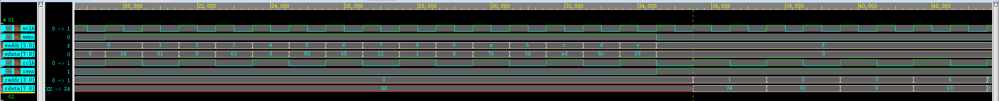
